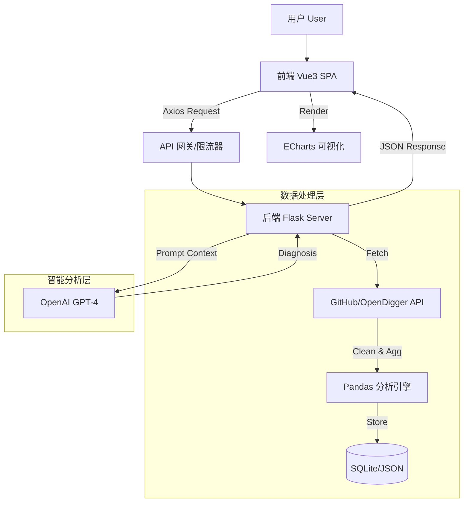

# OpenRank Visualization Platform: LLM Ecosystem Health Overview
# 🚀 OpenRank 可视化平台：LLM 生态健康度总览

<p align="center">
  
  
  
  
  
  
</p>

<p align="center">
  <strong>融合 OpenRank 算法模型与 OpenAI 智能分析的开源生态可视化解决方案</strong>
</p>

<p align="center">
  <a href="#-核心亮点-key-features">核心亮点</a> •
  <a href="#-系统架构-architecture">系统架构</a> •
  <a href="#-作品展示-showcase">作品展示</a> •
  <a href="#-快速开始-quick-start">快速开始</a> •
  <a href="#-开发路线-roadmap">开发路线</a>
</p>

---

## 📖 项目背景 (Background)

在开源软件（OSS）爆发式增长的今天，传统的 `Star` 数和 `Fork` 数已无法准确衡量一个项目的真实健康度。开发者和企业决策者面临着**“数据孤岛”**和**“指标晦涩”**的痛点。

**OpenRank Visualization Platform** 应运而生。我们不仅仅展示数据，更致力于**“解读”**数据。通过引入 **OpenRank** 影响力算法，结合 **LLM (Large Language Model)** 的自然语言处理能力，我们为每一个开源仓库生成专属的“体检报告”，让复杂的生态数据变得触手可及。

## 🏗️ 系统架构 (Architecture)

> *本项目采用高内聚、低耦合的前后端分离架构设计。*


## ✨ 核心亮点 (Key Features)
```
### 1. 🆚 多维对比分析系统

- **功能描述**：支持同时选取多个开源项目，在同一坐标系下进行 OpenRank、活跃度、Issue 响应速度的对比。
    
- **技术实现**：前端采用 ECharts 的 Dataset 管理多维数据，后端利用 **Pandas** 进行数据对齐（Reindexing）与归一化处理，确保不同量级的项目可被直观比较。
    

### 2. 🧠 AI 深度洞察与流式打字机特效

- **交互体验**：告别传统的“转圈等待”，我们实现了 ChatGPT 同款的**流式打字机效果**。用户在提问瞬间即可看到 AI 的逐字推理过程。
    
- **底层技术**：
    
    - **后端**：Flask 使用 Python 生成器 (yield) 开启流式响应 (Text/Event-Stream)。
        
    - **前端**：使用 fetch API 获取 ReadableStream，配合 TextDecoder 实时解码二进制流并追加到 UI 界面。
        

### 3. ⚠️ 智能风险卡片生成

- **功能描述**：系统不仅仅是被动展示数据，更能主动**“预警”**。AI 会根据 OpenRank 的连续下跌趋势，自动生成红色的“风险提示卡片”（如：核心贡献者流失警告）。
    
- **实现逻辑**：基于规则引擎（Rule-Based）预筛选高危指标，再动态 Prompt 给 LLM 生成简短的风险摘要，前端通过 v-for 动态渲染卡片组件。
    

### 4. 🏆 动态生态榜单

- **功能描述**：内置 LLM 生态健康度排行榜，支持按 OpenRank、Fork 数、活跃度实时排序。
    
- **数据层**：后端通过定时任务（Crontab）预计算排名数据存入 SQLite，接口响应速度 < 50ms。
```

## 💻 代码架构深度解析 (Code Analysis)

### 📂 后端结构 (/backend)

> 针对比赛评分标准中的“技术挑战”与“完成度”，本项目在代码层面做了以下深度设计：

### 1. 安全认证与数据库设计

- **JWT 无状态认证**：
    
    - 摒弃 Session，采用 flask-jwt-extended。在 backend/api/auth.py 中，用户登录成功后签发 Token。
        
    - **亮点**：前端 Axios 拦截器自动注入 Token，实现全站接口保护。
        
- **ORM 数据建模**：
    
    - 在 backend/models.py 中，使用 **SQLAlchemy** 定义 User 模型，内置 check_password 哈希校验方法，保障用户信息安全。
        

### 2. 前端状态持久化 (Persistence)

- **Pinia + Storage**：
    
    - 在 frontend/src/stores/user.js 中，我们配置了持久化插件。这意味着用户刷新页面后，**登录状态、当前选中的对比项目、AI 对话历史**都不会丢失，提供了原生 App 般的体验。
        

### 3. AI 流式交互核心代码

- **后端生成器 (backend/main.py)**：
```
def generate():
    for chunk in openai.ChatCompletion.create(..., stream=True):
        yield chunk.choices[0].delta.get("content", "")
return Response(generate(), mimetype='text/event-stream')
```
- **前端流式读取 (frontend/src/components/AIChat.vue)**：
    
    - 使用 reader.read() 循环读取数据流，实现字符级的实时上屏。

## 📸 UI/UX 交互亮点 (Showcase)

### 1. 登录与持久化 (Authentication)

> 简洁美观的登录界面，集成表单验证与错误提示。登录后 Token 自动持久化，刷新不丢失。  
> 
> 

### 2. 动态数据大屏 (Dynamic Dashboard)

> ECharts 图表随数据源动态刷新，支持暗色模式自适应。  
> 
> 

### 3. AI 流式打字机 (Streaming Typing)

> 能够看到 AI 逐字生成的思考过程，体验极致丝滑。  
> 
> 

## 📸 作品展示 (Showcase)
> *以下界面展示了平台的核心功能。*

### 1. 生态榜单与多维对比


实现多项目数据对比与排行榜


### 2. AI 流式打字机交互


实现丝滑的 AI 逐字生成效果

### 3. 数据概览仪表盘
![[dce8129a0e890768f5fb4680f44f3ae1.png]]
*实时展示 OpenRank 趋势与核心指标变化。*

### 4. AI 智能分析界面
![[bc254dbb82d6d197193a6eb8de5eb8a4.png]]
*基于 LLM 的项目健康度诊断报告生成。*

### 5. 智能风险卡片

自动识别项目潜在风险


(注：实际运行效果动态图演示即将上线)

## 🚀 快速部署 (Deployment)

### 环境要求 (Prerequisites)

- **Python**: 3.8+
    
- **Node.js**: 16.0+
    
- **Git**: 最新版本
    

### 1. 获取代码
```
git clone https://github.com/Hb-zzz-momo/openrank2.git
cd openrank2
```
### 2. 后端配置 (Backend)

服务默认端口：8000
cd backend

```
# 1. 创建虚拟环境 (隔离依赖，推荐)
python -m venv .venv
# Windows:
.\.venv\Scripts\activate
# Linux/Mac:
# source .venv/bin/activate

# 2. 安装依赖
pip install -r requirements.txt

# 3. 环境变量配置 (Windows PowerShell 示例)
# 如果需要使用 LLM 功能，请设置 Key，否则仅可使用基础数据功能
$env:OPENAI_API_KEY="sk-xxxxxxxxxxxxxxxxxxxxxxxx"

# 4. 启动服务
python main.py
```
### 3. 前端配置 (Frontend)

服务默认端口：5173

```
cd frontend

#1. 安装依赖
npm install

#2. 启动开发服务器
npm run dev

访问浏览器：http://localhost:5173 即可体验完整功能。

```
## ⚙️ 配置说明 (Configuration)

后端支持通过环境变量进行高级配置：

|   |   |   |
|---|---|---|
|变量名|描述|默认值|
|OPENAI_API_KEY|OpenAI 接口密钥 (用于 AI 分析)|无|
|FLASK_ENV|运行环境 (development/production)|development|
|PORT|后端服务端口|8000|
## 🗺️ 开发路线 (Roadmap)

**Phase 1: 基础构建**

完成 OpenRank 数据采集管道

搭建 Vue3 + Flask 基础框架

实现基础 ECharts 可视化

**Phase 2: 智能化升级 (Current)**

接入 OpenAI API

实现项目健康度自动生成报告

增加 API 限流保护

**Phase 3: 社区化与扩展 (Future)**

支持更多 LLM 模型 (Claude, 文心一言)

增加多项目对比分析功能

导出 PDF 格式分析报告

## ❓ 常见问题 (FAQ)

**Q: 没有 OpenAI Key 可以运行吗？**  
A: 可以。项目的基础数据可视化功能不依赖 OpenAI Key，仅“智能分析”模块需要该 Key。

**Q: 后端启动报错 Module not found？**  
A: 请确保您已经激活了虚拟环境 (.venv) 并且执行了 pip install -r requirements.txt。

## 🤝 贡献指南 (Contributing)

我们非常欢迎社区贡献！如果您想参与本项目：

1. Fork 本仓库
    
2. 创建您的特性分支 (git checkout -b feature/AmazingFeature)
    
3. 提交您的更改 (git commit -m 'Add some AmazingFeature')
    
4. 推送到分支 (git push origin feature/AmazingFeature)
    
5. 发起 Pull Request

## 📄 许可证 (License)

本项目基于 [MIT License](https://www.google.com/url?sa=E&q=LICENSE) 分发。